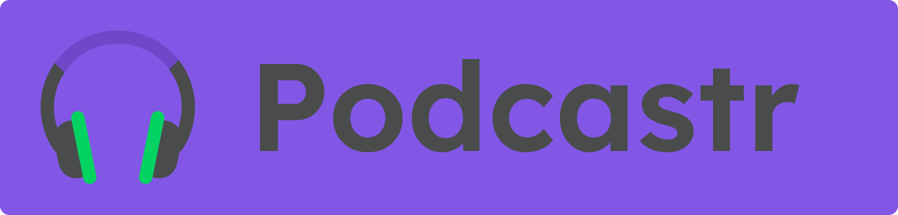

## 🧐 Sobre o projeto

Uma aplicação para ouvir podcasts :headphones: 

---
## ⚙️ Funcionalidades
- [x] Header da aplicação;
- [x] Player:
  - [x] Tocar música;
  - [x] Botão shuffle - para tocar em ordem aleatória;
  - [x] Botão loop - para tocar o podcast atual em loop;
  - [x] Botão next - para tocar o próximo podcast;
  - [x] Botão previous - para tocar o podcast anterior;
  - [x] Slider - para controle de minutagem do podcast;
- [x] Página Home:
  - [x] Listagem dos dois ultimos episódios lançados;
  - [x] Listagem dos demais episódios;
  - [x] Botão play para tocar o episódio selecionado;
- [x] Página do Episódio:
  - [x] Descrição e informações do episódio;
  - [x] Botão de play para tocar o episódio;
  - [x] Botão de back para retornar a página Home;
### Funcionalidades extras
- [x] Troca de temas da interface(claro e escuro);
  - [x] Refatoração de css modules para styled components;
  - [x] Tema atual é salvo em localstorage;
- [x] SideBar;
  - [x] Botão de logout;
  - [x] Botão de troca de temas;
- [x] Página de Login;
  - [x] Layout completo;
  - [x] Autenticação com GitHub pelo NextAuth;
- [x] A aplicação está responsiva;
- [x] A aplicação está totalmente funcional em produção;

---
## Como executar o projeto
### Pré-requisitos
- git 
- Node.js
- NPM ou Yarn
### Variáveis de Ambiente
Além das ferramentas anteriores é necessária criar uma váriavel de ambiente .env.local na raiz do projeto e adicionar as seguintes variáveis

 API_URL=https://my-json-server.typicode.com/IgorTargino/podcastr
### Instalação
```
# Abra o terminal e copie este repositório com o comando
$ git clone https://github.com/IgorTargino/podcastr.git

# Acesse a pasta do projeto no prompt de comando 
$ cd podcastr

# Instale as dependências
yarn install
ou
$ npm install

# Execute a aplicação
$ yarn dev
ou
$ npm run dev

# Acesse http://localhost:3000 no seu navagador.
```
## 🚀 Tecnologias 
Tecnologias utilizadas para desenvolver o projeto:
- next.js
  - ISR e SSG
- react.js
- typescript
- context
- axios
- sass
- rc-slider
- date-fns

## 🦸‍♂️ **Autor**

<p>
 <sub><strong>🌟 Igor Targino Marinho🌟</strong></sub>
</p>

[](https://www.linkedin.com/in/igor-targino/)
[](mailto:igortargino01@gmail.com)

>Este projeto foi desenvolvido com ❤️ por **[Igor Targino](https://github.com/IgorTargino)**, com o instrutor **[Diego Fernandes](https://www.linkedin.com/in/diego-schell-fernandes/)** durante a **[Next Level Week # 5 - Trilha ReactJS](https://nextlevelweek.com/)** da **[Rocketseat](https://rocketseat.com.br)** 💜<br> 
Se te ajudou, dá ⭐, vai me ajudar também 😉